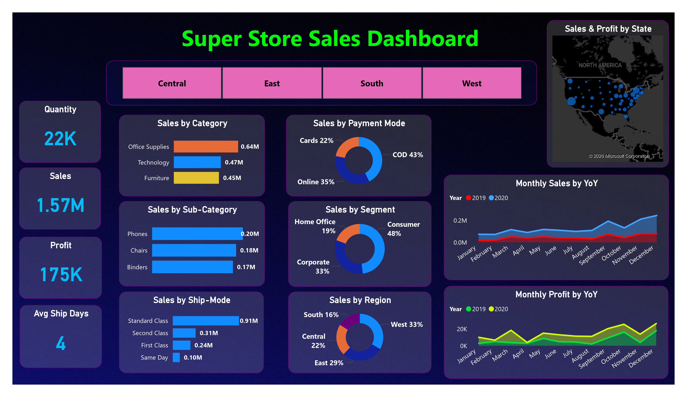
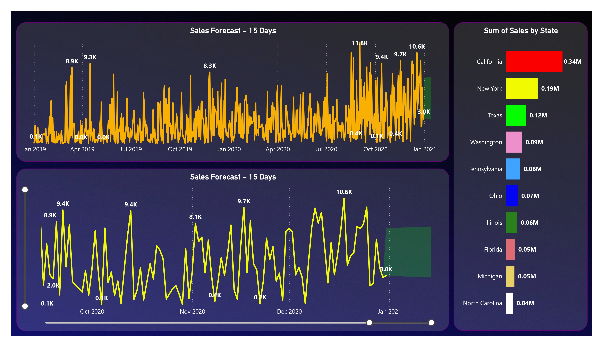

# 📊 Sales Analytics & Forecasting Dashboard

## 📌 Project Overview
This project focuses on contributing to business success by leveraging data analysis techniques, with a strong emphasis on **time series analysis**, to generate meaningful insights and accurate sales forecasts. An interactive dashboard is developed to help stakeholders monitor performance, analyze trends, and make data-driven decisions.

---

## 🎯 Project Objectives
- Analyze historical sales data to understand performance patterns  
- Apply time series analysis for accurate short-term forecasting  
- Build an interactive dashboard for KPI monitoring and insights  
- Provide actionable recommendations to support business growth, efficiency, and customer satisfaction  

---

## 🛠️ Project Components

### 1. Dashboard Creation
- Identified key performance indicators (KPIs) relevant to supermarket sales  
- Designed an intuitive and visually appealing dashboard  
- Added interactive visualizations and filters for multi-level data exploration  
- Enabled analysis at different levels of granularity  

### 2. Data Analysis
- Analyzed sales data to evaluate the effectiveness of sales strategies  
- Used charts and visualizations to identify trends, patterns, and seasonality  
- Delivered insights to support informed business decisions  

### 3. Sales Forecasting
- Leveraged historical sales data  
- Applied time series analysis techniques  
- Generated sales forecasts for the next **15 days** to support demand planning  

### 4. Actionable Insights & Recommendations
- Converted analytical findings into actionable business insights  
- Provided recommendations aligned with business objectives  
- Supported strategic decision-making to improve growth and operational efficiency  

---

## 📘 Learnings
- Applied data analysis techniques with a focus on time series analysis  
- Developed interactive dashboards for business users  
- Enhanced skills in data visualization and insight generation  
- Gained experience in translating data into strategic business value  

---

## 🧰 Tools & Techniques
- Data Cleaning and Transformation  
- Time Series Analysis  
- KPI Identification  
- Interactive Dashboard Development  

---

## ✅ Outcome
The project delivers a comprehensive sales analytics and forecasting solution that combines interactive dashboards, accurate forecasting, and actionable insights to enable data-driven business decision-making.

